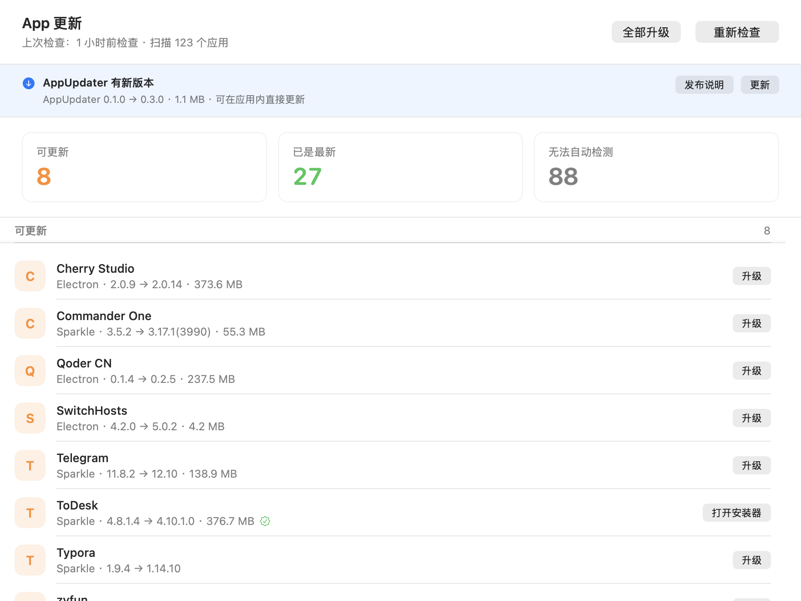
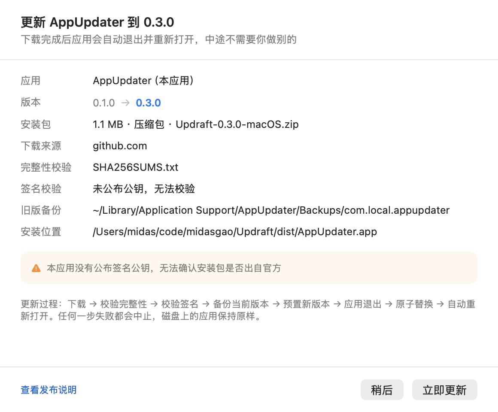

<h1 align="center">
  
  <br>
  Updraft
</h1>

<p align="center">
  <b>把 macOS 上散落各处的应用更新，收进一个窗口。</b><br>
  该更新的列出来，能一键升的点一下就升完；升不动的，如实告诉你为什么。
</p>

<p align="center">
  <a href="https://github.com/midasism/Updraft/actions/workflows/ci.yml"></a>
  <a href="https://github.com/midasism/Updraft/releases/latest"></a>
  
  
  
  
</p>

<p align="center">
  
</p>

macOS 没有统一的应用更新入口。App Store 管一批，Homebrew 管一批，手动拖进 `/Applications` 的各有各的更新器，剩下的一堆压根不告诉你有没有新版。

Updraft 把散落各处的更新状态收进一个窗口。本机实测：**扫描 122 个应用，检出 22 个有待更新**，全量检查 9.0–10.6 秒；升完一个应用后只重查那一个，**0.3–0.9 秒**出新状态。

> [!NOTE]
> 仓库叫 **Updraft**，编译产物与 `.app` 叫 **AppUpdater**，界面标题是「App 更新」——三个名字指同一个东西。后文涉及可执行文件路径时用的是 `AppUpdater`。

## 目录

- [功能](#功能)
- [截图](#截图)
- [安装](#安装)
- [使用](#使用)
- [工作原理](#工作原理)
- [备份与恢复](#备份与恢复)
- [已知限制](#已知限制)
- [开发](#开发)
- [路线](#路线)

## 功能

- 🔍 **一个窗口看全** — 三档分组（可更新 / 已是最新 / 无法自动检测）+ 三个统计卡片，一次扫完 `/Applications` 与 `~/Applications`。
- ⚡ **真能一键升完** — 不是“打开下载页让你自己点”：下载 → 验签 → 备份 → 原子换包 → 重新打开，全自动。单个升级和批量升级都走同一条链路。
- 🔐 **三道身份校验** — Ed25519 签名验证整个安装包，再叠 `codesign --verify --deep --strict` 与签名主体一致性。任何一道不过就地中止，磁盘上什么都没变。
- 📋 **动手前先摊开给你看** — 确认页列出 Bundle ID、版本跨度、包体积、下载来源、是否验签、备份落点、以及目标应用当前是否在运行。
- ↩️ **失败自动回滚** — 换包用同卷 `rename` 而非“删除 + 拷贝”，旧版本一直在盘上，回滚只是一次改名。
- 🧹 **中断能自愈** — 强制退出或断电留下的中间态文件，下次启动自动收拾；最坏情况（旧包已挪走、新包未就位）会把旧包搬回去。
- 🕵️ **拿不准就说拿不准** — feed 读不出来就标“不支持”，版本比对拿不到权威值就标“检查失败”，**绝不猜一个版本号糊弄你**。
- 🪞 **它自己也算一个待更新项** — 启动时顺带查一次自己的 GitHub Releases，有新版本就在顶部横幅里说清楚；点下去走的是和升级别家应用**同一条链路**：下载 → 校验 → 备份 → 换包 → 重新打开。换不动的时候（只读卷、不是从 `.app` 跑、磁盘不够）如实讲原因，并给出发布页地址让你手动下。
- 🖥️ **GUI 之外还有 CLI** — 检查、预演、执行、恢复、导出界面截图都有对应命令，方便脚本化与排查。

## 截图

<p align="center">
  
  
</p>

左：升级确认页。动手前把所有要发生的事列清楚——包体积、下载来源、验签方式、备份路径、升级期间应用是否需要先退出。
右：批量升级清单。只列出自动化能走完的条目，装不了的（需要管理员密码、没有公开安装包）不会混进来。

<p align="center">
  
</p>

自己也是列表外的一条：有新版本时顶部横幅直说“可在应用内直接更新”，右边的「更新」按钮进确认页，「发布说明」留一条想去 GitHub 看一眼的出路。

<p align="center">
  
</p>

自更新的确认页比别家应用多交代两件事：**旧版备份落在哪**、**这次要装到哪个位置**——因为目标就是用户正在用的这个包，位置错了整件事就不成立。

## 安装

### 一行命令（最省事，不用管 Gatekeeper）

```bash
curl -fsSL https://raw.githubusercontent.com/midasism/Updraft/main/scripts/install.sh | sh
```

自动取最新版 → 校验 SHA-256 → 退出正在运行的旧版本 → 装进 `/Applications` → 打开。指定版本：`curl -fsSL … | VERSION=0.2.1 sh`；想先看一眼脚本再执行，把首尾换成 `… -o /tmp/updraft-install.sh` 和 `sh /tmp/updraft-install.sh` 即可。

> [!TIP]
> **为什么这条命令不用处理「Apple 无法验证」？**
>
> Gatekeeper 只在文件带 `com.apple.quarantine` 属性时才介入，而这个属性是浏览器、邮件、AirDrop 这类经手方通过 LaunchServices 打上的标记。**curl 不经过 LaunchServices，它下载的东西不带这个属性**——于是未公证的 ad-hoc 包也能直接启动。
>
> 不买 Developer ID 的话，这就是唯一能做到「装完即开」的免费路径。下面那条 DMG 拖拽路线依然需要用户自己处理 Gatekeeper 弹窗。

### 手动下载（DMG / zip）

从 [Releases](https://github.com/midasism/Updraft/releases/latest) 下载 `Updraft-x.y.z-macOS.dmg`，打开后把图标拖进「应用程序」即可：

<p align="center">
  
</p>

也可以下载 `Updraft-x.y.z-macOS.zip`，解压后把 `AppUpdater.app` 拖进 `/Applications`——两者内容一致，DMG 只是多了一层拖拽窗口。

> [!IMPORTANT]
> 安装包只做了临时签名（ad-hoc），**没有走 Apple 公证**，所以从浏览器下载后首次打开会被 Gatekeeper 拦下，弹「Apple 无法验证…」（只有「完成」和「移到废纸篓」两个按钮）。
>
> **先别急着点「移到废纸篓」——包是好的，也不是签名坏了。** arm64 的可执行文件必须有签名才能加载，ad-hoc 是零成本下唯一的选择；被拦只是因为「没公证」这一件事。
>
> **macOS 15 (Sequoia) 起，老教程里的「右键 → 打开」已经失效**（Apple 在 Sequoia 移除了这个绕过入口，macOS 26 Tahoe 上同样无效）。现在只有两条路：
>
> **① 终端一条命令（最快）**
>
> ```bash
> xattr -dr com.apple.quarantine /Applications/AppUpdater.app
> ```
>
> 之后双击即可打开。（提示权限不足就在前面加 `sudo`。）
>
> **② 走系统设置**
>
> 先双击一次，让它被拦下——这一步不能省，那个按钮只会因为一次失败的启动而出现。然后打开
> **系统设置 → 隐私与安全性 → 安全性**，找到「已阻止使用"AppUpdater"…」那一行，点 **仍要打开**，输密码确认。
>
> ⚠️ 这个按钮只在被拦后约 1 小时内出现，且没有任何倒计时提示。找不到它就重新双击一次，再回设置页。
>
> 不建议为了单个应用关掉整个 Gatekeeper（`spctl --master-disable`）——那是拿全机器的安全换一个应用的方便。
>
> 顺手核对一下校验和更稳。把包和 `SHA256SUMS.txt` 下到同一个文件夹后：
>
> ```bash
> shasum -a 256 -c SHA256SUMS.txt
> ```

> [!NOTE]
> 发布产物是 **arm64-only**（CI 跑在 Apple Silicon runner 上）。Intel Mac 请走下面的源码构建。

### 从源码构建

```bash
git clone https://github.com/midasism/Updraft.git
cd Updraft
scripts/build-app.sh        # 编译 release，组装成 dist/AppUpdater.app
open dist/AppUpdater.app
```

要出和 Release 里一样的 DMG：

```bash
VERSION=0.3.0 scripts/build-dmg.sh     # 出 dist/Updraft-0.3.0-macOS.dmg
```

两个脚本都支持用 `VERSION` 注入版本号（写进 `Info.plist`），`build-app.sh` 另有 `BUILD_NUMBER`。

> [!TIP]
> 系统要求 macOS 13+，以及 Xcode 命令行工具（Swift 5.9+）。Swift 包**零第三方依赖**，不需要 `brew install` 任何东西。`build-dmg.sh` 会自己把打包工具 `dmgbuild` 装进 `.build/` 下的虚拟环境，同样不碰系统 Python。

## 使用

启动后自动检查一次，工具栏的「重新检查」可手动触发；同时会顺带查一次**自己**有没有新版本。检测逻辑与界面共用同一套代码，所以下面这些命令行入口看到的结果和窗口里完全一致：

```bash
AU="dist/AppUpdater.app/Contents/MacOS/AppUpdater"

$AU --check                  # 打印完整检测结果
$AU --plan-all               # 列出所有可自动升级的条目及预检详情（不下载）
$AU --install-all            # 升级全部可自动完成的条目
$AU --self-check             # 查自己有没有新版本，并打印预检详情（不下载、不写入）
$AU --recover                # 清理上一次被中断的安装残留
```

完整命令表：

| 命令 | 作用 |
|---|---|
| `--check` | 全量检查，打印完整结果 |
| `--refresh "<名字>"` | 只重查这一个应用（不重扫目录、不重建 brew 索引） |
| `--refresh-all` | 重查缓存里全部可探测的条目 |
| `--plan "<名字>"` / `--plan-all` | 升级预演，不下载、不写入 |
| `--install "<名字>"` / `--install-all` | 真实执行升级（命令行自己的编排） |
| `--job "<名字>"` | 真实执行升级，但走界面状态源那条路径（含升级收尾的增量刷新） |
| `--self-check` | 查自己的新版本并打印预检详情 |
| `--self-update` | 把当前这个包升级到最新版；正常结局就是**打印到交接那一步然后退出** |
| `--recover` | 清理上一次被中断的安装残留 |
| `--snapshot <路径> [--mode main / confirm / batch / running / cancelled / self-update / self-update-confirm]` | 导出界面截图 |

菜单栏里另有两个入口：**检查更新…**（强制查一次，查完直接弹出面板）和 **打开 Updraft 发布页面**（最后的兜底出口）。

`--refresh` 读的是 GUI 写下的检查结果缓存，所以先跑一次 `--check`（或打开窗口）让它有东西可刷。

`--install` 与 `--job` 都会真实替换 `/Applications` 里的应用包；`--plan` 是它们的预演。两者走的是两套编排，**只有 `--job` 覆盖升级收尾**，所以验证增量策略要用它。它是长任务，建议放后台跑并重定向日志：

```bash
NSUnbufferedIO=YES nohup "$AU" --job "IINA" >/tmp/updraft.log 2>&1 &
```

（`NSUnbufferedIO=YES` 是必需的：Swift 的 `print` 在 stdout 不是 TTY 时是块缓冲的，进程被强杀会丢掉整个缓冲区，日志一片空白。）

`--self-update` 的退出**不是崩溃**，而是流程本身：换包那两步要等这个进程消失才能做，助手正盯着它。所以别拿 `$?` 判断成败，看状态文件（见下面的「自己给自己升级」）。

## 工作原理

### 更新通道：不同来源走不同的路

| 来源 | 检测方式 | 更新动作 |
|---|---|---|
| Homebrew cask | `brew outdated --cask --greedy --json=v2` | 跑 `brew upgrade --cask`，带实时日志 |
| Sparkle | 读 `Info.plist` 的 `SUFeedURL`，拉 appcast.xml 比对版本 | **下载 → 校验签名 → 备份 → 原子替换** |
| Electron | 读包内 `app-update.yml`，走 GitHub Releases API 或 `latest-mac.yml` | 同上（dmg / zip） |
| App Store | 只识别（`_MASReceipt`） | 暂不支持 |
| Microsoft AutoUpdate | 只识别 | 暂不支持 |
| Adobe / 游戏 / JetBrains 等 | 只识别，并给出具体原因 | 暂不支持 |

分类优先级不能随意调换：`mac-mouse-fix` 这类应用既是 Homebrew cask 又内嵌 Sparkle，必须让 **Homebrew 优先**——只有它能在本机一键升完。

版本比对优先用构建号整数（Sparkle 里这是权威值），回退到点分版本号。两者都拿不到就判定为“检查失败”，**绝不猜测**。

> [!NOTE]
> 一个反直觉的边界：构建号**相等**时不能直接判定为最新，要继续比 `sparkle:shortVersionString`，否则“构建号相同但版本号更新”的应用会被漏掉。

### 全量检查 vs 增量刷新

一次全量检查有三笔开销：重建 brew cask 索引（`brew list` + `brew info --json=v2`）、遍历 `/Applications` 逐个读 `Info.plist`、对每个可探测应用发一次网络请求。

**升级完一个应用之后，前两笔的答案不会因为这次升级而改变**——重做纯属让用户干等；第三笔里也只有那个应用的结果真的变了，其余几十个的答案是白问的。所以升级收尾走的是增量路径：

```
只重读变更过的那一个包（AppScanner.inspect(bundleAt:)）
    ↓
只探它一个（brew 侧也只比对它那一个 cask token）
    ↓
并回列表，其余条目原样保留
```

- **不重建 brew 索引**，直接复用上一次全量检查的那份；索引只在 brew 装/卸 cask 时才会变，升级应用不会。拿不到索引（冷启动走缓存、或本机没装 Homebrew）时，按 Bundle ID 一致与否决定要不要沿用旧的来源判定——Bundle ID 变了说明路径上蹲的已经是另一个应用，旧结论就作废。
- 没有出现在刷新范围内的条目**一律不重查、不清空**。它们没有因为别的应用升级而失去可信度。
- 缓存里 `savedAt`（写入时间）和 `lastFullCheckAt`（上次全量时间）分开记：增量刷新只推前者，界面上“上次检查”仍取后者，免得对着没查过的应用撒谎。
- 某个包被删了或挪走了就如实标成“检查失败”，**不静默丢掉那一行**。

全量与增量共用 `CheckEngine`，没有第二套探测逻辑；区别只是入参规模。`CheckEngine` 只依赖 `UpdateProbing` 协议，因此测试里可以用“只记账不发请求”的假探针精确断言探测范围——有人把收尾改回整机重扫，测试会立刻发现。

### 一键升级的执行流程

```
检查上次中断的残留
    ↓
下载安装包（带进度）
    ↓
EdDSA 签名校验 ──── 不通过就地中止，磁盘上什么都没变
    ↓
解包 dmg / zip
    ↓
确认包身份（Bundle ID、版本、代码签名、签名主体是否换了人）
    ↓
备份旧版本
    ↓
优雅退出正在运行的应用（退不掉就中止，不强杀）
    ↓
同一卷内 rename 原子换包
    ↓
验证新版本 + 重新打开应用
    ↓
任何一步失败 → 自动回滚到旧版本
```

所有会在磁盘上留下痕迹的操作都排在备份与换包之后，**绝大多数失败不会在磁盘上留下任何痕迹**。

### 三道独立的身份校验

任一条不过就中止：

1. **Ed25519 签名** — 用应用自己 `Info.plist` 里公布的 `SUPublicEDKey`，对下载到的整个文件做密码学验签。本机 27 个应用公布了公钥，实测 AlDente 的 12.2 MB dmg 验签通过。
2. **代码签名** — `codesign --verify --deep --strict`；严格模式不过会退到普通校验并记一条警告（Electron 应用在严格模式下常报无关的 warning）。
3. **签名主体一致性** — Bundle ID 必须一致；Team ID 或证书主体变了要拦下来。若该应用没有公布公钥，主体变化就是硬性拒绝；有公钥且验签通过则降级为警告。

签名校验是三态而非布尔值——“没有公钥”和“签名对不上”是完全不同的两件事，前者界面标“未校验”，后者必须中止。

### 换包为什么用 rename

```
ditto 新包 → /Applications/.<名字>.<token>.new.app
rename 旧包 → /Applications/.<名字>.<token>.old.app     ← 原子
rename 新包 → /Applications/<名字>.app                  ← 原子
删除 .old.app
```

`rename` 是原子的，不存在“App 被删到一半掉电导致它消失”的窗口；旧包在换包瞬间被改名而非删除，所以回滚只是一次 rename。文件名加 `.` 前缀，Finder 里天然不可见。

另外三个容易忽略的点：三个路径必须在**同一个卷**上（跨卷 rename 会退化成拷贝，就失去原子性，所以 staging 目录建在目标 App 所在目录而非 `/tmp`）；用 `ditto` 而不是 `cp -R`（要连同符号链接、扩展属性、ACL 一起搬，否则签名校验可能过不了）；解包后按 Bundle ID 精确定位目标 `.app` 时**必须跳过符号链接**（很多 dmg 里放了指向 `/Applications` 的快捷方式）。

### 自己给自己升级：一条链路，一个绕不过去的约束

自己这一条的检测源不是 appcast，而是**本仓库的 GitHub Releases 公开接口**（`/releases/latest`，不需要 token）。选它的理由是省事且不容易坏：**发版就是打 tag**，已经在跑的发布流水线一个字都不用改，也不用为了自更新再维护一份 appcast。未认证接口每小时只让敲 60 次，所以结果缓存 3 小时，失败不落盘——一次网络抖动不该让接下来几小时都看不到新版本。

升级动作复用别家应用那一整套（下载 → 校验和 → Ed25519 签名 → 解包 → 确认身份 → 备份），只在最后一步分道扬镳，因为这里有个物理约束：

```
应用（还活着）    下载 → 校验 → 解包 → 确认身份 → 备份 → 把新包预置到目标同目录
                   ↓ 写出脚本并启动它
                   ↓ 退出
助手（独立 sh）    等应用真的退出 → 改走旧包 → 新包就位 → 复核 → 清 quarantine → 打开 → 删旧包
```

**正在运行的进程没法把自己脚下的包换掉。** `.app` 改名之后老进程还活着，但它加载的代码、要读的资源都还指着旧 inode，换完既没法安全继续跑，也没法自己重启。所以最后两次改名必须交给另一个进程。

为什么那是个 `sh` 脚本，而不是“把本应用复制一份再带参数启动”：`sh`、`mv`、`open`、`xattr` 都不在要被替换的那个 bundle 里。换成自家二进制的话，它脚下的包正被换掉，后续任何一次动态加载都可能失败——这是一条没必要走的钢丝。

三条容易忽略的边界：

1. **判定“这个包还在用吗”必须按路径，不能按进程名。** `pgrep -x AppUpdater` 会把“另一份副本在跑”误伤成“应用被重新打开了”——开发机上 `dist/` 和 `/Applications` 两份并存是常态，用户也可能同时留着旧版。脚本用 `lsof -- <这个包的可执行文件>` 与 `pgrep -f -- <这个包>/Contents/MacOS/` 两个独立探针，任一命中就当作在用；探针本身出错也按在用处理。**宁可这次不升级，也不能把运行中实例脚下的包抽走。**
2. **放弃时要把预置好的新包清掉。** 不然用户会在应用旁边看到一个隐藏的 `.AppUpdater.<token>.new.app`——一份完整的新版本拷贝，而这次更新压根没发生。（这个是真机验证时踩出来的：更新被拒之后，目标旁边静静躺着一份副本。）清理带了道保险：**只在目标完好的时候删**；目标不在，说明已经进了换包中途，那该由启动时的残留恢复接管，多删一个文件可能删掉的是唯一一份完好的包。
3. **等退出不能只认 `kill -0`。** 它对僵尸进程一样返回成功——那已经死了，只是还没被收尸，只认它就会白等满 60 秒然后放弃整次更新。所以要再看一眼 `ps -o state=`，排除 `Z` 状态。

助手跑在应用已经退出之后，出了问题没人能弹窗，所以它把结果写进 `~/Library/Application Support/AppUpdater/self-update-status.txt`，**下次启动读一次并消费掉**（只读一次，否则每次启动都会重播“上次更新成功了”）。没有这份文件，用户面对的就是“点了更新、应用关了、再打开还是旧版本”，而真相只有助手知道。

格式刻意用 `key=value` 的行文本而不是 JSON：写它的是一个 shell 脚本，在 shell 里拼 JSON 要处理引号与反斜杠转义，漏一个字符就写出坏文件——而这份文件恰恰是换包失败时唯一的证据来源。

换不动的三种情况在点确认**之前**就说清楚，而不是试到一半才失败：不是从 `.app` 里跑（脚本直接跑）、在 `/System` 或 `/Volumes` 下（系统自有、只读卷）、磁盘空间不够（下载包 + 解包副本 + 预置副本要同时存在，按包体积 × 3 + 300 MB 估）。这三种都退回“打开 Release 页面让你自己下”。另外，`/Applications` 之外的位置只要可写也允许——开发时从 `dist/` 直接验证整条链路就靠这一点。

### 关于 `.delta` 文件

Sparkle 的 appcast 里，`<sparkle:deltas>` 下挂的也是 `<enclosure>`，但它们指向的是**增量补丁**（魔数 `spk!`，XZ 压缩的二进制差分），必须由 Sparkle 拿着旧包应用，单独下载下来**永远装不上**。

这是 v0.1 真实踩过的坑：解析器没有感知嵌套，`<enclosure>` 按“后写覆盖先写”处理，于是把补丁的地址和体积当成了正式包——界面上显示 2.3 MB，点下载拿到的东西根本装不上。

修正后规则有两条，缺一不可：

1. 记录 `deltas` 的嵌套深度，其中的 `<enclosure>` 只计数、绝不写入下载字段；
2. 正式包的字段**先到先得**（`if current.downloadURL == nil`），否则同一 item 内的其他 `<enclosure>` 会覆盖它。

只做第 1 条不够——有些 feed 在正式包之后还有别的同类标签；只做第 2 条也不够——`deltas` 排在正式包前面时就挡不住。这条边界有 7 个回归测试守着。补丁数量仍保留在 `AppcastItem.deltaCount` 里，为将来支持增量升级留了接口。

## 备份与恢复

旧版本备份到 `~/Library/Application Support/AppUpdater/Backups/<Bundle ID>/<时间戳>-<版本>/`，每个应用只保留最近 1 份（IINA 一个包就 104 MB，无限留存会变成磁盘黑洞）。

安装流程中间被强杀（强制退出、断电）会留下隐藏的中间态文件，下次启动时会自动收拾。恢复逻辑的判据是**目标应用是否完好**：

| 状态 | 行为 |
|---|---|
| 目标完好 | 中间态文件都是冗余的，删掉 |
| 目标缺失/损坏，有 `.old.app` | **把旧包搬回去**——这是应用唯一的一份 |
| 目标缺失，无可用的旧包 | **什么都不删**，原样保留并上报，交给人判断 |

最后一行是关键：这种情况下删任何东西都是不可逆的数据损失。

**自己给自己升级也走这一套**，没有第二份恢复逻辑。助手预置新包用的名字是 `.<名字>.<token>.new.app`、被换下来的旧包是 `.<名字>.<token>.old.app`——这个形状正是 `Installer.classifyArtifact` 认得的那种，所以助手万一被强杀，下次启动的残留清理会直接接管，不需要为自更新另写一套。同理，中途被打断留下的那份预置包，在目标完好的时候会被当成冗余清掉。

同一目录（`~/Library/Application Support/AppUpdater/`）下还有两样东西，各有各的用途：

| 文件 | 用途 | 生命周期 |
|---|---|---|
| `self-update-status.txt` | 助手的执行结果 | 下次启动读一次即删（只消费一次） |
| `self-update-<token>.log` | 助手的完整现场记录 | 保留**最近一份**（按修改时间，不是文件名） |
| `self-update-<token>.sh` | 一次性助手脚本 | 跑完即清；被强杀留下的也会在下次启动时清掉 |
| `self-update.json` | 版本检查的节流缓存 | 3 小时过期；查失败不落盘 |

脚本看一眼就该删、日志留一份——因为用户报“更新完就不对劲”的时候，那份日志是唯一的现场。

## 已知限制

- 46 个应用没有公开的更新接口（Adobe 全家桶、Steam / Battle.net / Epic、JetBrains Toolbox、VMware Fusion、Logi Options+ 等），只能标记。
- 5 个应用（AltTab、ChatGPT、CheatSheet、Codex、PopClip）内嵌了 Sparkle 但更新源硬编码在程序里，读不出来。
- ToDesk 用的是 `.pkg` 安装器，需要管理员密码，只能交给系统安装器。
- 未公布 `SUPublicEDKey` 的应用无法做密码学验签，界面上会明确标注“未校验”。
- LM Studio 用 s3 provider，配置里只有 bucket，拼不出可访问地址，不猜。
- 少数应用的 appcast 已经失效（ClashX 返回 404、Vox 返回 410），会显示为「检查失败」而不是假装是最新。
- 增量刷新不重建 brew 索引，因此拿不到索引时会沿用上一次的分类结果（Bundle ID 一致才沿用）。这只会影响“这个应用归谁管”这一类判定，下一次全量检查会自我纠正。

自己更新自己这一侧的边界：

- **v0.2.1 及更早的版本还没有这个能力**，所以那之前的每一次升级都得手动装一次；从带自更新的版本开始，之后就不需要了。
- 未配 `SELF_UPDATE_ED_KEY` 时，自更新只能依赖校验和与代码签名——**校验和证明不了“出自官方”**（它和包躺在同一个 Release 里），界面上会如实标注“未校验开发者签名”。
- 从 dmg 里直接运行（挂在 `/Volumes` 下）无法原地替换：那是只读卷，换不了。会引导到发布页。
- 不是从 `.app` 包里跑（比如 `swift run`）时读不到自身版本号，整条自更新链路降级为“打开发布页”——不拿一个猜的版本号去比对。
- 同一个路径上还有别的实例在跑时会**拒绝升级**并让你先退出它（这是刻意的：宁可不升，也不能把运行中实例脚下的包抽走）。这里按**包路径**判断，不按进程名——所以从 `dist/` 跑开发版、同时 `/Applications` 里还有一份正式版在跑，不会互相误伤。
- 应用在 60 秒内没退出就放弃整次更新。它卡住了的时候，硬来比放弃危险。
- 检测源是 GitHub 的公开接口，未认证每小时 60 次，所以检查结果缓存 3 小时；点「重新检查」会强制绕过缓存。

## 开发

```bash
swift build --disable-sandbox      # 编译
swift test  --disable-sandbox      # 208 个单元测试
```

> [!WARNING]
> 若报 `sandbox-exec: sandbox_apply: Operation not permitted`，说明 SwiftPM 编译 manifest 时套的内层沙箱被挡了（受限终端、沙箱化 IDE、CI 容器里都常见），加 `--disable-sandbox` 即可。这是环境问题，不是代码问题。

CI 在 `macos-latest` 上跑 `swift build`（Debug + Release）与 `swift test`，见 [`.github/workflows/ci.yml`](.github/workflows/ci.yml)。

### 打包与发布

| 脚本 | 产出 |
|---|---|
| `scripts/build-app.sh` | `dist/AppUpdater.app`——编译 release、组装 bundle、签名 |
| `scripts/notarize.sh` | 送上面那个 `.app` 去 Apple 公证并 staple 票据（没配凭据就跳过） |
| `scripts/build-dmg.sh` | `dist/Updraft-<版本>-macOS.dmg`——调前者出 `.app`，再套一层拖拽安装窗口 |

发布走 tag：推一个 `v*` 标签，[`.github/workflows/release.yml`](.github/workflows/release.yml) 会自动编译、出 DMG 与 zip、算 SHA-256、建 Release。手动触发同一个工作流则只出 Actions Artifacts，不建 Release，用来单独验证流水线。

### 自更新的包签名（可选，但它是自更新唯一的信任锚）

应用给自己升级时，**校验和不够用**：`SHA256SUMS.txt` 和安装包躺在同一个 Release 里，能改包的人同样能改校验和。它只能证明“下载没坏”，证明不了“出自官方”。Ed25519 签名用一把只存在于 GitHub Secrets 里的私钥，才是真正的锚。

不配这把钥匙也不影响使用，应用会在确认页和报告里如实标注“未校验开发者签名”——**配了就启用，没配就降级**，跟公证那条路一个路子。

| Secret | 内容 | 怎么拿 |
|---|---|---|
| `SELF_UPDATE_ED_KEY` | 私钥（base64 的 32 字节） | 跑 `swift tools/ReleaseSign.swift keygen` 生成 |
| `SELF_UPDATE_ED_PUBLIC_KEY` | 公钥（base64 的 32 字节） | 同上，一次生成、两个一起给出 |

```bash
swift tools/ReleaseSign.swift keygen                                    # 生成一对密钥
swift tools/ReleaseSign.swift sign <私钥> <包> <签名输出>                # 手动签（流水线里自动做）
swift tools/ReleaseSign.swift verify <公钥> <包> <签名文件>              # 复核签名
```

公钥由 `build-app.sh` 写进 `Info.plist` 的 `SUPublicEDKey`，私钥只在发布时用；流水线会同时给 zip 和 dmg 各出一份 `<包名>.ed25519`。**基元和 Sparkle 完全一致**（32 字节原始私钥 / 32 字节原始公钥 / 64 字节签名，base64 流转），键名也沿用 `SUPublicEDKey`，所以 `SignatureVerifier` 那份给别家应用用的校验逻辑一个字没改就能复用——我们不过是自己更新的“上游”，用的还是同一套规矩。

签名是**三态**而非布尔值：「没公布公钥」和「签名对不上」是完全不同的两件事——前者界面标“未校验”，后者必须中止。

### 代码签名与公证（可选，但它决定用户的第一印象）

**现状**：默认只做 ad-hoc 签名，产物未公证，用户首次打开会被 Gatekeeper 拦下——绕法见上面的「安装」一节。

**想让用户双击即开，只有 Developer ID + 公证一条路**（需要 Apple Developer Program，$99/年）。免费替代方案基本已被堵死：Homebrew 的 `--no-quarantine` 被移除，官方 tap 自 2026 年 9 月起也不再收未签名未公证的 cask。

流水线已经预留好了，**不需要改任何代码**——`build-app.sh` 与 `notarize.sh` 都是「配了凭据就正式签名 + 公证，没配就退回 ad-hoc」。往仓库加六个 secret，整条链路自动切换；不配则行为与现在完全一致：

| Secret | 内容 | 怎么拿 |
|---|---|---|
| `APPLE_CERT_P12` | Developer ID Application 证书的 base64 | 从钥匙串导出 `.p12`，再 `base64 -i cert.p12 \| pbcopy` |
| `APPLE_CERT_PASSWORD` | 导出 `.p12` 时设的密码 | 导的时候自己定 |
| `APPLE_CODESIGN_IDENTITY` | `Developer ID Application: 名字 (TEAMID)` | `security find-identity -v -p codesigning` |
| `APPLE_NOTARY_KEY_ID` | App Store Connect API Key 的 Key ID | App Store Connect → 用户和访问 → 集成 → 密钥 |
| `APPLE_NOTARY_ISSUER_ID` | Issuer ID | 同一个页面顶部 |
| `APPLE_NOTARY_KEY_P8` | `.p8` 私钥文件的**内容** | 创建密钥时只能下载一次，先存好 |

两处顺序是硬性的，脚本里已经断言：签名必须带 hardened runtime 与时间戳（公证的前置条件），公证必须发生在出包之前（票据钉在 `.app` 上，dmg 和 zip 才都能带上）。`notarize.sh` 还会在提交前先自检签名，把「证书配错了」这类问题从几分钟的排队之后提前到一秒内报出来。

有证书的机器上要跑全流程：

```bash
CODESIGN_IDENTITY="Developer ID Application: 名字 (TEAMID)" VERSION=0.3.0 scripts/build-app.sh
NOTARY_KEY_PATH=~/AuthKey.p8 NOTARY_KEY_ID=xxx NOTARY_ISSUER_ID=yyy scripts/notarize.sh
VERSION=0.3.0 SKIP_APP_BUILD=1 scripts/build-dmg.sh
```

注意顺序不能颠倒：`staple` 之后 `.app` 就不能再改了，一改票据就失效。

安装窗口的布局写在 `scripts/dmg-settings.py`，背景图由 `tools/DmgBackground.swift` 生成。**这两处共用一套坐标**（窗口左下角为原点）：窗口左上角那个箭头是画在背景图里的，改图标坐标就必须同步改背景图，否则箭头会和图标错位——没有自动校验，只能靠人盯。

DMG 用 [dmgbuild](https://github.com/dmgbuild/dmgbuild) 而不是 `hdiutil` + AppleScript：窗口里图标的摆位存在卷根的 `.DS_Store` 里，用 AppleScript 摆图标等于驱动 Finder 去改这份 `.DS_Store`，而 Finder 自动化需要 GUI 会话与「自动化」权限，CI 上不可靠。dmgbuild 自己直接写 `.DS_Store`，全程不碰 Finder。

### 目录结构

```
Sources/AppUpdaterKit/
  Models/      AppInfo / AppSource / UpdateResult / ReleaseInfo / UpgradeJob
               SelfIdentity / SelfUpdateRelease / SelfUpdateStatus —— 纯数据
  Core/        扫描、分类、版本比对、进程执行、缓存、检查编排
               UpdateProbing（探针协议）/ IncrementalChecker（增量刷新与合并）
               SignatureVerifier / PackageDownloader / BackupStore / Installer
               PackageExtractor（解包，Installer 与自更新共用）
               SelfUpdateChecker / SelfUpdater / SelfUpdateHandoff
  Probes/      Sparkle 与 Electron 两套探针 + appcast 解析
  UI/          SwiftUI 界面 + 状态源 + 自更新面板
  CLI/         --check / --refresh / --job / --plan / --install
               --self-check / --self-update / --recover / --snapshot
Sources/AppUpdater/main.swift   可执行入口
Tests/AppUpdaterTests/          208 个单元测试
tools/ReleaseSign.swift         自更新包的 Ed25519 签名工具（keygen / sign / verify）
```

分层的关键约束：**检测逻辑不认识 UI，UI 不认识网络**。

自更新还多一条：**解包逻辑只有一份**。`Installer`（给别人升）和 `SelfUpdater`（给自己升）都调 `PackageExtractor`——dmg 挂载、符号链接跳过、按 Bundle ID 定位 `.app` 这些坑不值得踩两遍。

### 新增一种更新来源

只需两步，别的文件都不用动：

1. 在 `Probes/` 加一个实现 `UpdateProbing` 的探针；
2. 在 `AppClassifier` 里加一条判定。

这是为接入 App Store、Chrome 私有更新接口等预留的扩展点。因为 `CheckEngine` 只依赖协议（探针走 `UpdateProbing`，brew 结果走一个闭包），它的检查范围可以被精确断言，不需要真的发请求。

### 测试策略

- **纯逻辑单测** — 版本比对（边界：相等、递增整数 vs 点分、空值、后缀）、appcast XML 解析、`app-update.yml` 解析，用真实抓取的 XML 片段做 fixture。
- **扫描器测试** — 对临时构造的伪 `.app` 目录树断言分类结果。
- **探针测试** — 注入 stub HTTP 客户端，覆盖 200 / 404 / 超时 / 畸形 XML 四条路径。
- **重点回归** — appcast 增量补丁 7 条、签名校验 6 条（真实 Ed25519 密钥对签名通过、篡改一个字节必须失败、换公钥必须失败、缺公钥判“跳过”而非失败）、中断恢复 10 条。
- **自更新的交接脚本** — 助手脚本是拼字符串生成的，所以一部分断言直接读文本（两次改名的先后、结果先落盘再 `open`、每个变量都必须写成 `${NAME}`）。但**关键几条是真跑脚本**：造一个临时目录里的假 `.app`，配假的 `open` 和一个确定不存在的 PID，跑完整脚本再核对退出码、包内容、状态文件与残留。这里出过两个“只有真跑才看得见”的问题：`$FROM）` 被 macOS 的 sh 当成变量名（配 `set -u` 就是当场退出，用户看到的是“点了更新、应用关了、再打开还是旧版本”），以及放弃更新时预置的新包被留在盘上。另外脚本还要过一道 `sh -n`，语法改坏一定会被发现。
- **端到端** — 在真机上对真实应用做完整替换。dmg 路径实测 Rectangle `0.86 → 1.100`，zip 路径实测 KeyCastr `0.10.3 → 0.11.1`，升级后 `codesign --verify --deep --strict` 均通过，`/Applications` 无残留、无遗留挂载。
- **自更新的端到端** — 在临时目录放一份标着 `0.1.0` 的旧包，让它真的去 GitHub 把 `0.2.1` 拉下来换掉自己：换完版本对、`codesign --verify --deep --strict` 过、无隔离属性、无中间态残留、备份是 `0.1.0`、重新打开的实例确实在跑。**全程 `/Applications` 里那份正式版都在运行**——这同时证明了“按路径判断”没有误伤另一份副本。拒绝路径也单独跑过：让同一个包的另一个实例占着它，助手必须拒绝换包、目标一个字节不动、且不留下预置副本。

单元测试证明不了真机替换，**这部分必须真跑**。真机跑出来的问题有一半在单元测试的视野之外：脚本语法过了不等于语义对了，顺序对了不等于这一步真的生效。

## 路线

- **v0.3** — 每日定时后台检查 + 系统通知；菜单栏图标。
- **v0.4** — 接入 App Store 应用；针对 Chrome 私有更新接口、JetBrains Toolbox 等做专门适配。
- **长期** — 支持 Sparkle 增量补丁（`spk!` 格式），大应用（IINA 104 MB、Cherry Studio 372 MB）升级可以少下载很多。

## 生态

Updraft 站在 [Sparkle](https://sparkle-project.org/)、[Homebrew Cask](https://github.com/Homebrew/homebrew-cask) 和 Electron 各自的公开更新接口之上，没有自己发明一套更新协议。设计取舍与踩坑记录见 [`docs/plans/`](docs/plans/)。
