<h1 align="center">
  
  <br>
  Updraft
</h1>

<p align="center">
  <b>把 macOS 上散落各处的应用更新，收进一个窗口。</b><br>
  该更新的列出来，能一键升的点一下就升完；升不动的，如实告诉你为什么。
</p>

<p align="center">
  <a href="https://github.com/midasism/Updraft/actions/workflows/ci.yml"></a>
  <a href="https://github.com/midasism/Updraft/releases/latest"></a>
  
  
  
  
</p>

<p align="center">
  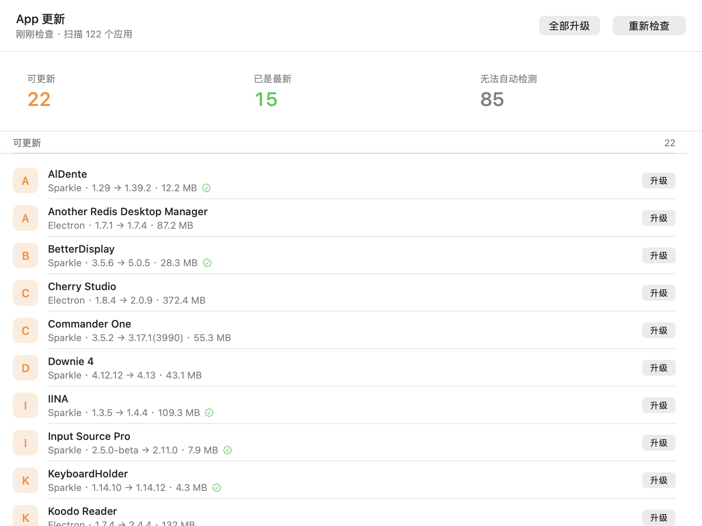
</p>

macOS 没有统一的应用更新入口。App Store 管一批，Homebrew 管一批，手动拖进 `/Applications` 的各有各的更新器，剩下的一堆压根不告诉你有没有新版。

Updraft 把散落各处的更新状态收进一个窗口。本机实测：**扫描 122 个应用，检出 22 个有待更新**，全量检查 9.0–10.6 秒；升完一个应用后只重查那一个，**0.3–0.9 秒**出新状态。

> [!NOTE]
> 从 **v0.3.4** 起，仓库、产物、Bundle ID 与界面标题统一叫 **Updraft**；**v0.3.3 及更早**叫 **AppUpdater**。
>
> ⚠️ **v0.3.3 及更早的用户需要手动重新安装一次**（下载 DMG 或 zip 覆盖安装，见[安装](#安装)）。
> 改名顺带换了 Bundle ID，而老版本的自更新会拿包内 Bundle ID 跟目标应用比对、不一致就拒绝安装，
> 所以老版本**升不到** v0.3.4+，报错是「安装包的 Bundle ID 是 `com.local.updraft`，与目标应用
> `com.local.appupdater` 不一致」。
>
> 装完 v0.3.4+ 就不用再管了：首次启动会自动把 `~/Library/Application Support` 与
> `~/Library/Caches` 下的旧目录、以及老设置搬到新名字；换包时目录若还叫 `AppUpdater.app`，
> 也会顺手改成 `Updraft.app`；此后自更新恢复正常。装完请把 `/Applications/AppUpdater.app` 删掉，
> 别留两份。

## 目录

- [功能](#功能)
- [截图](#截图)
- [安装](#安装)
- [使用](#使用)
- [工作原理](#工作原理)
- [备份与恢复](#备份与恢复)
- [已知限制](#已知限制)
- [开发](#开发)
- [路线](#路线)

## 功能

- 🔄 **自己也能升自己** — 查 GitHub Releases、校验清单 Ed25519 与 zip SHA-256、原子换包后自动打开新版本。入口在菜单「检查 Updraft 更新…」，不混进主应用列表。
- 🔍 **一个窗口看全** — 三档分组（可更新 / 已是最新 / 无法自动检测）+ 三个统计卡片，一次扫完 `/Applications` 与 `~/Applications`。
- 🔎 **找得到想找的那个** — header 里一个搜索框，`⌘F` 聚焦、`Esc` 清空，按名称与 Bundle ID 实时过滤三档分组；筛选时「全部升级」自动收窄成「升级这 N 个」，**所见即所升**。三张统计卡片始终是全量口径，不跟着筛选跳——它回答的是「这台机器整体什么样」，而且菜单栏徽标取的是同一个数。
- ⚡ **真能一键升完** — 不是“打开下载页让你自己点”：下载 → 验签 → 备份 → 原子换包 → 重新打开，全自动。单个升级和批量升级都走同一条链路。
- 🔐 **三道身份校验** — Ed25519 签名验证整个安装包，再叠 `codesign --verify --deep --strict` 与签名主体一致性。任何一道不过就地中止，磁盘上什么都没变。
- 📋 **动手前先摊开给你看** — 确认页列出 Bundle ID、版本跨度、包体积、下载来源、是否验签、备份落点、以及目标应用当前是否在运行。
- ↩️ **失败自动回滚** — 换包用同卷 `rename` 而非“删除 + 拷贝”，旧版本一直在盘上，回滚只是一次改名。
- 🧹 **中断能自愈** — 强制退出或断电留下的中间态文件，下次启动自动收拾；最坏情况（旧包已挪走、新包未就位）会把旧包搬回去。
- 🗄️ **备份不会变成磁盘黑洞** — 每个应用只留最近 1 份旧包（IINA 一个包就 104 MB）；设置页把当前占用直接量给你看，不满意就地清空。清空是**两步确认**，因为清了不可恢复。
- 🧾 **版本号说得清来路** — Homebrew 判断「过期」靠的是它自己账本里记的已安装版本，而不是磁盘上 `.app` 的真实版本。应用被自带的更新器升过之后账本会滞后，于是出现「报过期、实际已最新」。列表按账本写升级起点并附注磁盘真实版本，确认页说清点下去是把同一个版本重装一遍（顺带修正账本）——**不把它伪装成一次正常升级**。
- 🍎 **App Store 应用也查得出版本** — 走公开的 iTunes Lookup 接口，商店上有新版就列进「可更新」并给出体积；点「下载」跳 App Store 页面（装还是 App Store 自己装，本工具不碰 `/Applications`）。实测本机 18 个 App Store 应用全部查得到，其中 9 个本来就有更新被漏在「无法自动检测」里。
- 🐙 **开源应用接 GitHub Release** — 内嵌 Sparkle 但 feed 硬编码、或压根没有公开更新接口的开源应用（AltTab、Insomnia、FlClash、Zed、DBeaver、Clash Verge…），只要在白名单里就走 GitHub Releases API 查版本；tag 的 `v` 前缀与 `core@13.2.0` 这类写法都会自动归一。点「下载」跳 Release 页。查询结果带 1 小时磁盘缓存，一小时内反复检查不再消耗 API 限额。
- 🕵️ **拿不准就说拿不准** — feed 读不出来就标“不支持”，版本比对拿不到权威值就标“检查失败”，**绝不猜一个版本号糊弄你**。
- 📌 **菜单栏常驻，也可以不常驻** — 图标旁的数字就是待更新数；下拉里看上次检查时间，「立即检查」不开窗口也能跑，跑的还是同一个引擎。不想要它就在设置里关掉，屏幕顶部随即干净：**没的只是图标**，定时检查照跑、通知照弹、⌘Q 照旧。回程是 Dock 图标打开主窗口，或直接 ⌘,。
- ⏰ **每日定时检查 + 系统通知** — 到点在后台自动查（错过时段恢复后补一次，当天查过不重复），有更新弹系统通知、点按直达主窗口；权限被拒就安静闭嘴，状态照旧在菜单栏上。
- 🖥️ **GUI 之外还有 CLI** — 检查、预演、执行、恢复、导出界面截图都有对应命令，方便脚本化与排查。

## 截图

<p align="center">
  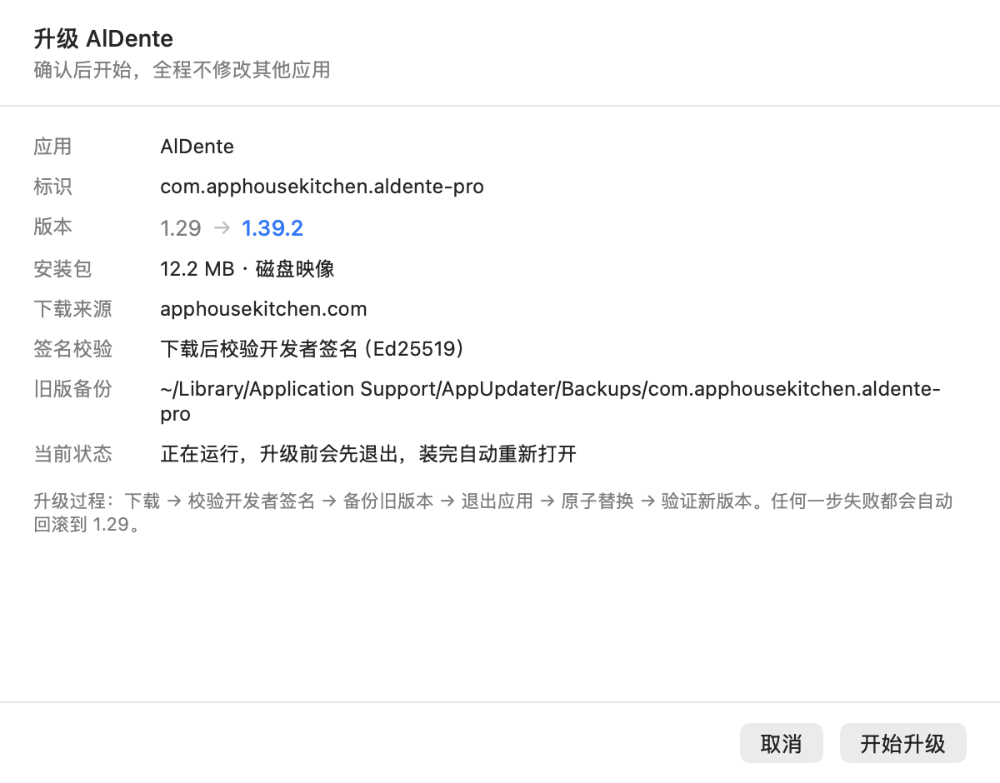
  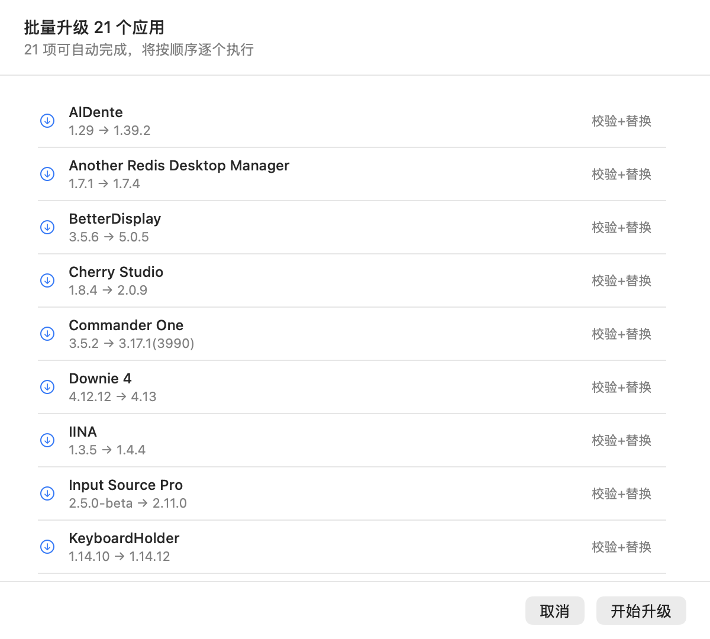
</p>

左：升级确认页。动手前把所有要发生的事列清楚——包体积、下载来源、验签方式、备份路径、升级期间应用是否需要先退出。
右：批量升级清单。只列出自动化能走完的条目，装不了的（需要管理员密码、没有公开安装包）不会混进来。

<p align="center">
  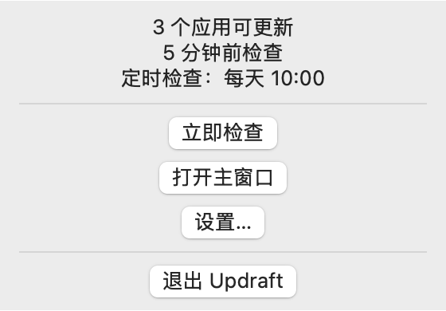
  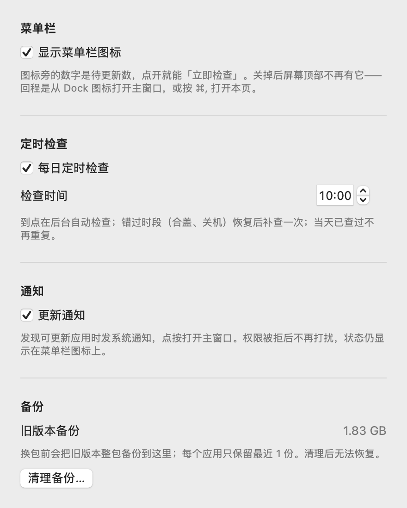
</p>

左：菜单栏下拉（合成状态，条目与真机一致；真机是系统原生菜单外观）。右：设置窗口——菜单栏图标开关、定时检查时刻、通知开关、备份占用与清理，改完即生效，重启后仍在。系统通知横幅依赖权限，走不了 `--snapshot`，真机关主窗口后点「立即检查」即可看到。

清理备份是**就地确认**，不是弹窗：

<p align="center">
  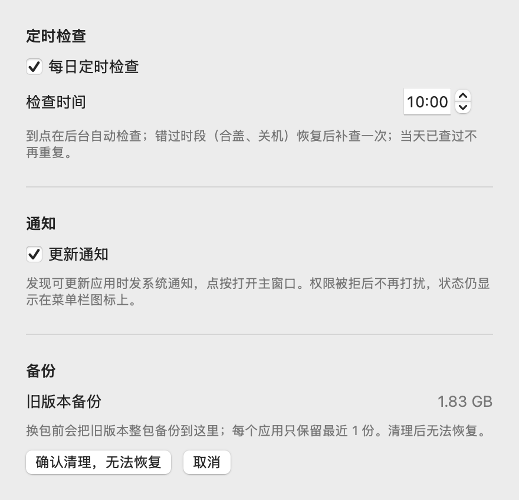
</p>

两个理由：一是这个动作不值得为一次确认引入模态；二是本项目踩过「**模态面板挂着时 `NSApp.terminate` 是空操作**」这个坑（`SelfQuit` 里有四组对照实验），用户开着确认框去退出应用却退不掉，比多点一下糟得多。顺带的好处是就地确认能被 `--snapshot --mode settings-confirm` 复现，弹窗不行。

菜单栏图标本身也是可关的（默认开，见上一节）。关掉后**受影响的只有图标**，但「图标 + 通知」两个出口都关掉时，后台就真成了闷头查——设置页把这件事当场说出来：

<p align="center">
  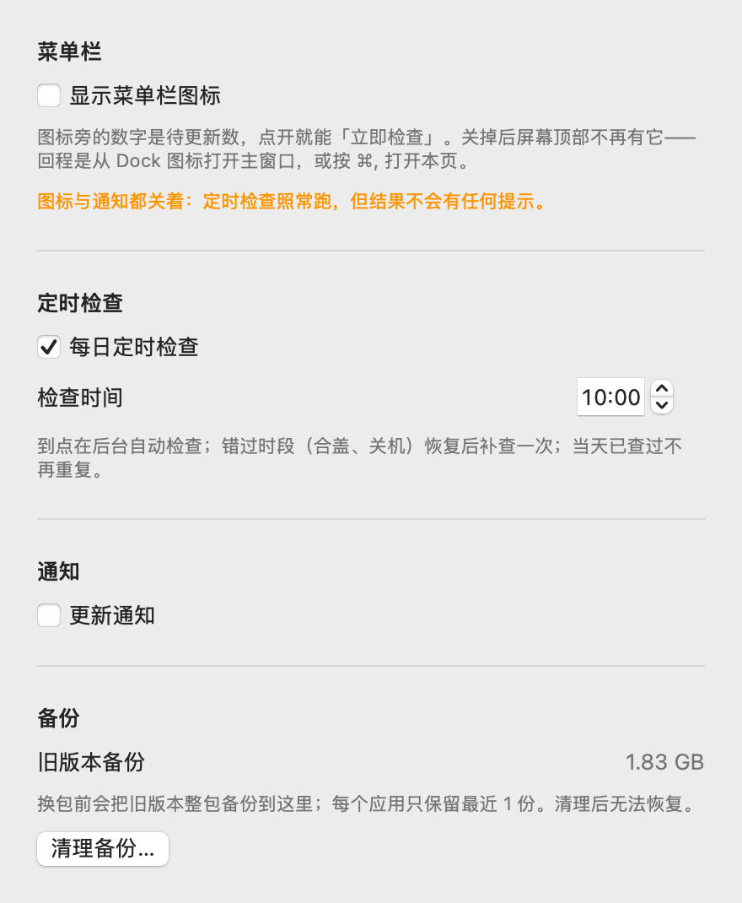
</p>

```bash
$AU --snapshot /tmp/icon-off.png --mode settings-icon-off
```

<p align="center">
  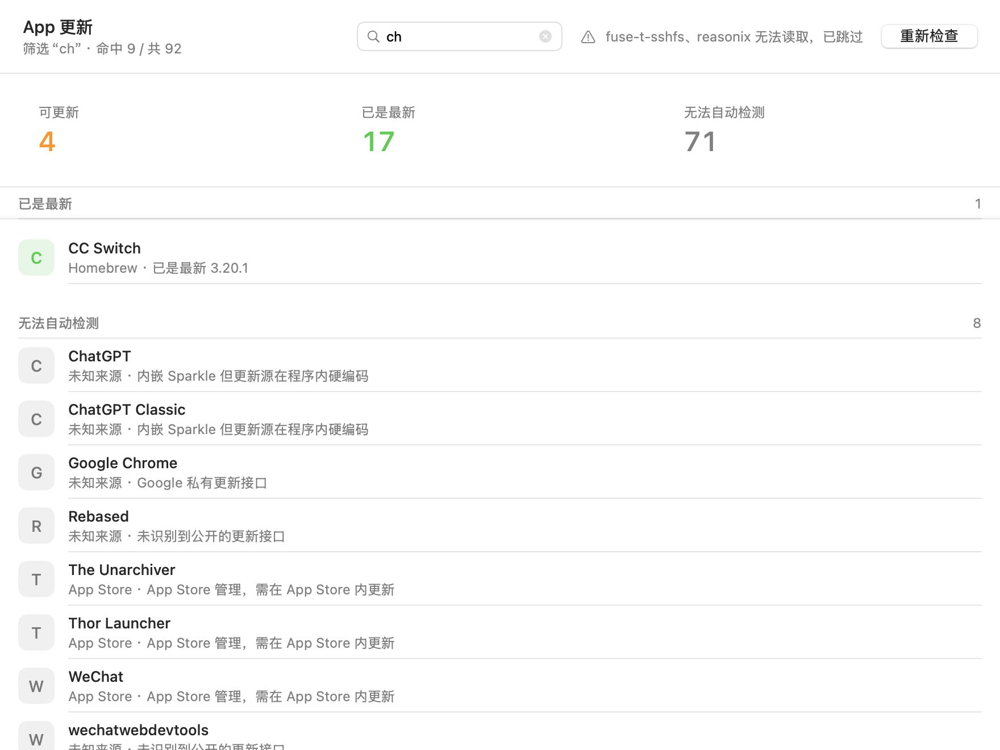
  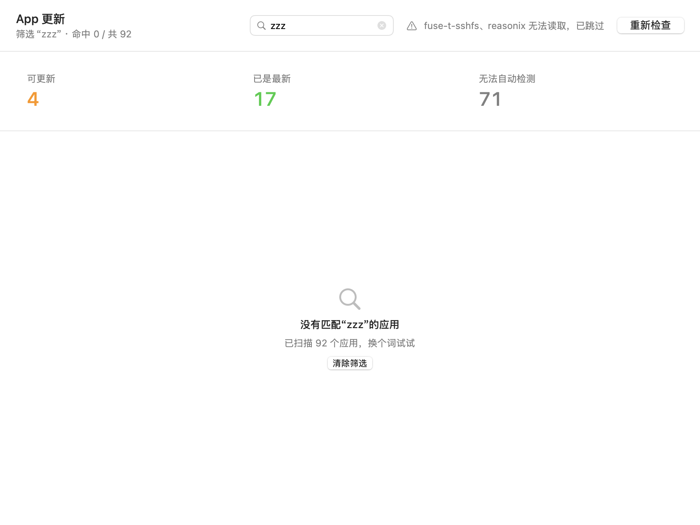
</p>

左：筛选态。输入 `ch` 后列表只剩命中的 9 条，副标题给出「命中 9 / 共 92」；**三张统计卡片仍是 4 / 17 / 71，与不筛选时一字不差**——它们回答的是整机状况，不跟着筛选跳。右：零命中。这个空态与「还没有结果」是两句话，一个是没搜到，一个是没查过。

两张图都能重跑，不是手点出来的：

```bash
$AU --snapshot /tmp/search.png --mode main --query "ch"
$AU --snapshot /tmp/nomatch.png --mode main --query "zzz"
```

<p align="center">
  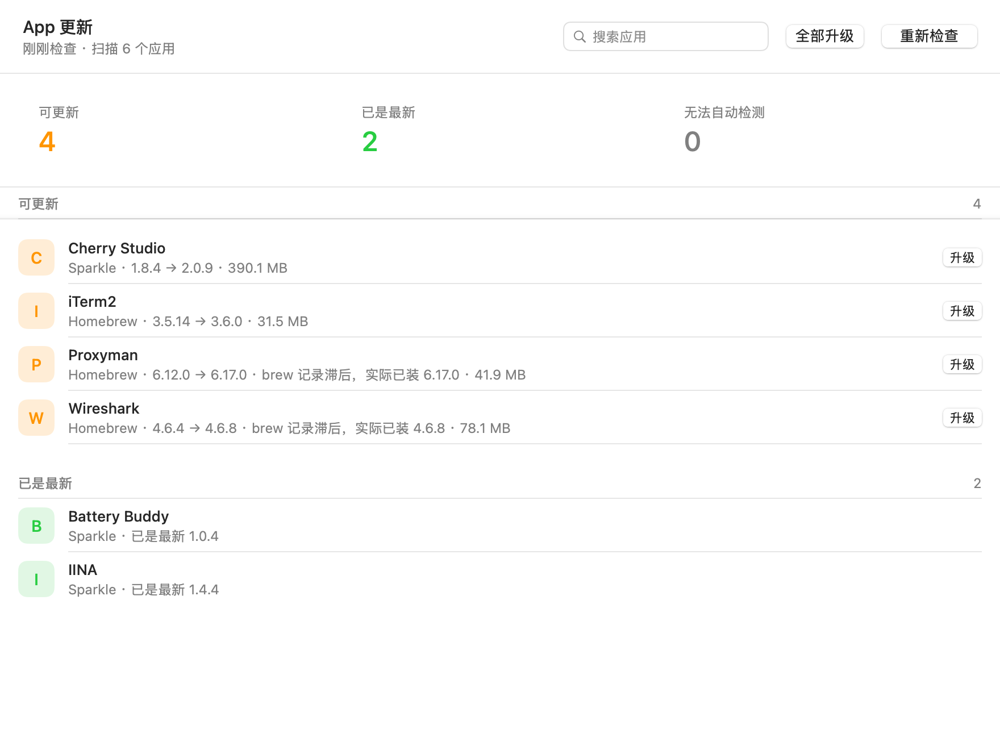
</p>

上图是 Homebrew 特有的一种「假更新」。`Proxyman` 磁盘上早就是 `6.17.0` 了，但 Homebrew 的账本还停在 `6.12.0`——应用被自带的更新器升过，而 `brew upgrade` 会连账本一起改，所以这次升级显然不是 brew 干的。brew 拿账本比 tap，自然报「过期」。

界面按**账本**写升级起点，再附注磁盘真实版本，`6.17.0 → 6.17.0` 这种看着像版本号算错了的写法不会再出现。`iTerm2` 那一行是账本一致的对照——同样走 Homebrew，显示上没有任何多余的附注。

```bash
$AU --snapshot /tmp/ledger.png --mode ledger
```

这张图和菜单栏、设置同属**合成状态**：它要求机器上某个 cask 恰好账本滞后，账本一被修正就再也截不出来，合成才可复现。

## 安装

### 一行命令（最省事，不用管 Gatekeeper）

```bash
curl -fsSL https://raw.githubusercontent.com/midasism/Updraft/main/scripts/install.sh | sh
```

自动取最新版 → 校验 SHA-256 → 退出正在运行的旧版本 → 装进 `/Applications` → 打开。指定版本：`curl -fsSL … | VERSION=0.2.1 sh`；想先看一眼脚本再执行，把首尾换成 `… -o /tmp/updraft-install.sh` 和 `sh /tmp/updraft-install.sh` 即可。

> [!TIP]
> **为什么这条命令不用处理「Apple 无法验证」？**
>
> Gatekeeper 只在文件带 `com.apple.quarantine` 属性时才介入，而这个属性是浏览器、邮件、AirDrop 这类经手方通过 LaunchServices 打上的标记。**curl 不经过 LaunchServices，它下载的东西不带这个属性**——于是未公证的 ad-hoc 包也能直接启动。
>
> 不买 Developer ID 的话，这就是唯一能做到「装完即开」的免费路径。下面那条 DMG 拖拽路线依然需要用户自己处理 Gatekeeper 弹窗。

### 手动下载（DMG / zip）

从 [Releases](https://github.com/midasism/Updraft/releases/latest) 下载 `Updraft-x.y.z-macOS.dmg`，打开后把图标拖进「应用程序」即可：

<p align="center">
  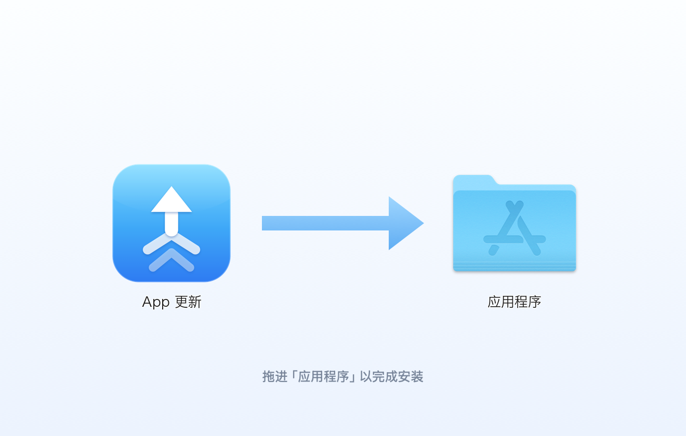
</p>

也可以下载 `Updraft-x.y.z-macOS.zip`，解压后把 `Updraft.app` 拖进 `/Applications`——两者内容一致，DMG 只是多了一层拖拽窗口。

> [!IMPORTANT]
> 安装包只做了临时签名（ad-hoc），**没有走 Apple 公证**，所以从浏览器下载后首次打开会被 Gatekeeper 拦下，弹「Apple 无法验证…」（只有「完成」和「移到废纸篓」两个按钮）。
>
> **先别急着点「移到废纸篓」——包是好的，也不是签名坏了。** arm64 的可执行文件必须有签名才能加载，ad-hoc 是零成本下唯一的选择；被拦只是因为「没公证」这一件事。
>
> **macOS 15 (Sequoia) 起，老教程里的「右键 → 打开」已经失效**（Apple 在 Sequoia 移除了这个绕过入口，macOS 26 Tahoe 上同样无效）。现在只有两条路：
>
> **① 终端一条命令（最快）**
>
> ```bash
> xattr -dr com.apple.quarantine /Applications/Updraft.app
> ```
>
> 之后双击即可打开。（提示权限不足就在前面加 `sudo`。）
>
> **② 走系统设置**
>
> 先双击一次，让它被拦下——这一步不能省，那个按钮只会因为一次失败的启动而出现。然后打开
> **系统设置 → 隐私与安全性 → 安全性**，找到「已阻止使用"Updraft"…」那一行，点 **仍要打开**，输密码确认。
>
> ⚠️ 这个按钮只在被拦后约 1 小时内出现，且没有任何倒计时提示。找不到它就重新双击一次，再回设置页。
>
> 不建议为了单个应用关掉整个 Gatekeeper（`spctl --master-disable`）——那是拿全机器的安全换一个应用的方便。
>
> 顺手核对一下校验和更稳。把包和 `SHA256SUMS.txt` 下到同一个文件夹后：
>
> ```bash
> shasum -a 256 -c SHA256SUMS.txt
> ```

> [!NOTE]
> 发布产物是 **arm64-only**（CI 跑在 Apple Silicon runner 上）。Intel Mac 请走下面的源码构建。

### 从源码构建

```bash
git clone https://github.com/midasism/Updraft.git
cd Updraft
scripts/build-app.sh        # 编译 release，组装成 dist/Updraft.app
open dist/Updraft.app
```

要出和 Release 里一样的 DMG：

```bash
VERSION=0.3.0 scripts/build-dmg.sh     # 出 dist/Updraft-0.3.0-macOS.dmg
```

两个脚本都支持用 `VERSION` 注入版本号（写进 `Info.plist`），`build-app.sh` 另有 `BUILD_NUMBER`。

> [!TIP]
> 系统要求 macOS 13+，以及 Xcode 命令行工具（Swift 5.9+）。Swift 包**零第三方依赖**，不需要 `brew install` 任何东西。`build-dmg.sh` 会自己把打包工具 `dmgbuild` 装进 `.build/` 下的虚拟环境，同样不碰系统 Python。

## 使用

启动后自动检查一次，工具栏的「重新检查」可手动触发。检测逻辑与界面共用同一套代码，所以下面这些命令行入口看到的结果和窗口里完全一致：

```bash
AU="dist/Updraft.app/Contents/MacOS/Updraft"

$AU --check                  # 打印完整检测结果
$AU --self-check             # 检查本工具自己有没有新版本
$AU --self-install           # 下载、验签、替换自己（装在 /Applications 时）
$AU --plan-all               # 列出所有可自动升级的条目及预检详情（不下载）
$AU --install-all            # 升级全部可自动完成的条目
$AU --recover                # 清理上一次被中断的安装残留
```

完整命令表：

| 命令 | 作用 |
|---|---|
| `--check` | 全量检查，打印完整结果 |
| `--refresh "<名字>"` | 只重查这一个应用（不重扫目录、不重建 brew 索引） |
| `--refresh-all` | 重查缓存里全部可探测的条目 |
| `--plan "<名字>"` / `--plan-all` | 升级预演，不下载、不写入 |
| `--install "<名字>"` / `--install-all` | 真实执行升级（命令行自己的编排） |
| `--job "<名字>"` | 真实执行升级，但走界面状态源那条路径（含升级收尾的增量刷新） |
| `--recover` | 清理上一次被中断的安装残留 |
| `--self-check` | 检查本工具自己的 GitHub Release |
| `--self-install` | 对本工具执行下载 → 验签 → 自替换 |
| `--snapshot <路径> [--mode …]` | 导出界面截图（`main / ledger / confirm / batch / running / cancelled / menubar / settings / settings-confirm / settings-icon-off`） |
| `--query "<词>"` | 配合 `--snapshot` 使用，把筛选态渲染进截图（仅对 `main` 模式生效） |

`--refresh` 读的是 GUI 写下的检查结果缓存，所以先跑一次 `--check`（或打开窗口）让它有东西可刷。

`--install` 与 `--job` 都会真实替换 `/Applications` 里的应用包；`--plan` 是它们的预演。两者走的是两套编排，**只有 `--job` 覆盖升级收尾**，所以验证增量策略要用它。它是长任务，建议放后台跑并重定向日志：

```bash
NSUnbufferedIO=YES nohup "$AU" --job "IINA" >/tmp/updraft.log 2>&1 &
```

（`NSUnbufferedIO=YES` 是必需的：Swift 的 `print` 在 stdout 不是 TTY 时是块缓冲的，进程被强杀会丢掉整个缓冲区，日志一片空白。）

### 后台盯着：菜单栏、定时检查与通知

关掉主窗口应用仍在运行（⌘Q 才退出），菜单栏图标常驻：

- **图标旁的数字**是待更新数，没有更新时只剩一个环形箭头；
- **不想要这个图标**就在设置里关掉（默认开）。关的只是这个图标：定时检查照跑、通知照弹、⌘Q 照旧。关掉后的回程是 **Dock 图标 → 主窗口**，或按 **⌘,** 直接开设置——图标与通知两个出口都关掉时，设置页会就地多一行提示，不让「查了跟没查一样」憋着；
- 下拉里能看到上次检查时间与定时计划，「立即检查」不开窗口就能跑——与主窗口「重新检查」是同一个引擎（`CheckEngine`），结果逐字一致；
- **每日定时检查**（设置里可开关、可改时刻，默认每天 10:00）：到点在后台跑全量检查；合盖、关机错过的时段，唤醒/启动后补查一次；**当天查过（不管手动还是自动）就不重复**；
- **系统通知**：后台检查发现可更新应用时弹出，点按打开主窗口。你在主窗口里看到的检查结果不会再弹通知（看着结果还弹是打扰）；通知权限被系统拒掉后安静跳过，状态照旧能从菜单栏看到。

设置从三个入口到达：主窗口右上角齿轮、菜单栏「设置…」、⌘,（关掉菜单栏图标后是前两个 —— 右上角齿轮与 ⌘,）。持久化在 UserDefaults 固定 suite（`com.local.updraft`），裸跑可执行文件与 `.app` 包读到的是同一份。

> [!NOTE]
> 系统通知依赖 UserNotifications，需要进程有 bundle identifier——`dist/Updraft.app` 没问题；`swift run` 直接裸跑可执行文件时通知整体退化为 no-op（一碰 UNUserNotificationCenter 就会崩，代码里按 bundle 探测跳过了），菜单栏与定时检查不受影响。

## 工作原理

### 更新通道：不同来源走不同的路

| 来源 | 检测方式 | 更新动作 |
|---|---|---|
| Homebrew cask | `brew outdated --cask --greedy --json=v2` | 跑 `brew upgrade --cask`，带实时日志 |
| Sparkle | 读 `Info.plist` 的 `SUFeedURL`，拉 appcast.xml 比对版本 | **下载 → 校验签名 → 备份 → 原子替换** |
| Electron | 读包内 `app-update.yml`，走 GitHub Releases API 或 `latest-mac.yml` | 同上（dmg / zip） |
| App Store | 走公开的 iTunes Lookup 接口查最新版（`itunes.apple.com/lookup`，免费、无鉴权） | **打开 App Store 页面，不由本工具安装** |
| GitHub 白名单 | 走公开的 GitHub Releases API 查最新版（`api.github.com/repos/<owner>/<repo>/releases/latest`，免费、无鉴权），范围由手工维护的 `GitHubReleaseCatalog` 决定 | **打开 Release 页面，不由本工具安装** |
| Microsoft AutoUpdate | 只识别 | 暂不支持 |
| Adobe / 游戏 / JetBrains 等 | 只识别，并给出具体原因 | 暂不支持 |

分类优先级不能随意调换：`mac-mouse-fix` 这类应用既是 Homebrew cask 又内嵌 Sparkle，必须让 **Homebrew 优先**——只有它能在本机一键升完。

版本比对优先用构建号整数（Sparkle 里这是权威值），回退到点分版本号。两者都拿不到就判定为“检查失败”，**绝不猜测**。

> [!NOTE]
> **App Store 条目查得到版本，但装不了——这是故意的。** 走的是公开的 `itunes.apple.com/lookup?bundleId=…` 接口（免费、无鉴权、无频率限制），只回答“商店上现在是哪一版”。安装那一步按钮停在**「下载」**（打开 App Store 页面），绝不会变成「升级」——App Store 的包由系统与 `macappstore://` 体系管理，本工具不往 `/Applications` 里换。批量升级也不会把它们卷进来（`InstallAction.isAutomated` 为 `false`）。
>
> 两个实测细节：接口对“查不到”返回的是 **HTTP 200 + 空数组**（不是 404），所以不能靠状态码判断；`bundleId` **原样拼进查询、不做任何剥离**——`5ZSL2CJU2T.com.dingtalk.mac` 这种带 team 前缀的原样就命中，剥掉前缀的 `com.dingtalk.mac` 反而 0 条，而且剥前缀可能撞上另一个开发者的同名反向域名。清单里也**没有** `bundleVersion` 字段，所以版本只比营销版本号，本地的 `CFBundleVersion`（`255`、`58012001` 这类整数）不参与比对。

> [!NOTE]
> **GitHub 白名单条目同样只查不装。** 没有可靠途径从包内自动推出 owner/repo（`io.github.*` 反推只对部分项目成立，猜错就是查到别人的仓库），所以范围由一张手工维护的表 `GitHubReleaseCatalog` 决定，表外的应用行为完全不变。tag 格式五花八门——`v0.8.98`、`core@13.2.0`、`26.2.0` 三种并存——探针里统一归一：取最后一个 `@` 之后的、剥 `v` 前缀、剥不出版本号的**视为查不到**（宁可少报不可错报）。`/releases/latest` 自动排除 draft 与 prerelease。未登录限额是 60 次/小时，命中时这些条目会如实报「GitHub API 限额」而不是装作已最新。

> [!NOTE]
> **GitHub 查询结果有 1 小时磁盘缓存，Electron 通道与白名单共用。** 第一次检查把响应裁剪到只剩两个探针都用到的字段（`tag_name` / `html_url` / assets 的名字与体积）落盘，之后一小时内无论检查多少次都**不再发请求**。过期后带 ETag 条件重验证——这里有个实测推翻文档的细节：GitHub 文档说 304 不消耗限额，但未登录场景实测**照样消耗**（50→49→48 对照实验，2026-09-16）。所以 TTL 内零请求才是省限额的唯一手段，ETag 只负责过期后省带宽；缓存文件损坏按无缓存处理，绝不把缓存故障升级成检查失败。查不到 Release 的错误响应（如仓库已消失的 404）不缓存，每次照常重查。

> [!NOTE]
> 一个反直觉的边界：构建号**相等**时不能直接判定为最新，要继续比 `sparkle:shortVersionString`，否则“构建号相同但版本号更新”的应用会被漏掉。

> [!NOTE]
> **Homebrew 的「已安装版本」有两份，别混。** brew 判断过期靠的是 **Caskroom 账本**（安装时写下的版本目录名），而磁盘上 `.app` 里的 `CFBundleShortVersionString` 是另一回事。应用被自带的更新器升过之后两者会分叉：账本说 `6.12.0`、磁盘上已是 `6.17.0`、tap 里最新也是 `6.17.0`。此时若左值读磁盘、右值读 tap，就会拼出 `6.17.0 → 6.17.0` 这种自相矛盾的写法。所以升级起点一律取 `brew outdated` 的 `installed_versions`，两者不一致时再把磁盘真实版本附注出来。

### 全量检查 vs 增量刷新

一次全量检查有三笔开销：重建 brew cask 索引（`brew list` + `brew info --json=v2`）、遍历 `/Applications` 逐个读 `Info.plist`、对每个可探测应用发一次网络请求。

**升级完一个应用之后，前两笔的答案不会因为这次升级而改变**——重做纯属让用户干等；第三笔里也只有那个应用的结果真的变了，其余几十个的答案是白问的。所以升级收尾走的是增量路径：

```
只重读变更过的那一个包（AppScanner.inspect(bundleAt:)）
    ↓
只探它一个（brew 侧也只比对它那一个 cask token）
    ↓
并回列表，其余条目原样保留
```

- **不重建 brew 索引**，直接复用上一次全量检查的那份；索引只在 brew 装/卸 cask 时才会变，升级应用不会。拿不到索引（冷启动走缓存、或本机没装 Homebrew）时，按 Bundle ID 一致与否决定要不要沿用旧的来源判定——Bundle ID 变了说明路径上蹲的已经是另一个应用，旧结论就作废。
- 没有出现在刷新范围内的条目**一律不重查、不清空**。它们没有因为别的应用升级而失去可信度。
- 缓存里 `savedAt`（写入时间）和 `lastFullCheckAt`（上次全量时间）分开记：增量刷新只推前者，界面上“上次检查”仍取后者，免得对着没查过的应用撒谎。
- 某个包被删了或挪走了就如实标成“检查失败”，**不静默丢掉那一行**。

全量与增量共用 `CheckEngine`，没有第二套探测逻辑；区别只是入参规模。`CheckEngine` 只依赖 `UpdateProbing` 协议，因此测试里可以用“只记账不发请求”的假探针精确断言探测范围——有人把收尾改回整机重扫，测试会立刻发现。

### 一键升级的执行流程

```
检查上次中断的残留
    ↓
下载安装包（带进度）
    ↓
EdDSA 签名校验 ──── 不通过就地中止，磁盘上什么都没变
    ↓
解包 dmg / zip
    ↓
确认包身份（Bundle ID、版本、代码签名、签名主体是否换了人）
    ↓
备份旧版本
    ↓
优雅退出正在运行的应用（退不掉就中止，不强杀）
    ↓
同一卷内 rename 原子换包
    ↓
验证新版本 + 重新打开应用
    ↓
任何一步失败 → 自动回滚到旧版本
```

所有会在磁盘上留下痕迹的操作都排在备份与换包之后，**绝大多数失败不会在磁盘上留下任何痕迹**。

### 本工具自己怎么更新

主列表是「本机的其他应用」，Updraft 自己不混进去。菜单「检查 Updraft 更新…」和 `--self-check` / `--self-install` 走另一条同源链路：

```
GitHub Releases API（/repos/midasism/Updraft/releases/latest）
    ↓
tag 与 CFBundleShortVersionString 比对（三态：有更新 / 已是最新 / 检查失败）
    ↓
下载 zip → 验签 update.json（Ed25519）→ 对照 sha256 → 解包 → codesign
    ↓
备份旧包 → 把自己 rename 成 .old → 新包就位 → 拉起新实例
    ↓
新实例启动时按中断自愈逻辑清掉 .old
```

验签同样是三态：缺公钥或缺清单标「未校验」，签名对不上或校验和不符必须中止、磁盘零残留。Release 流水线在出 SHA256SUMS.txt 之后签 `update.json`；没配 `UPDRAFT_ED25519_PRIVATE_KEY` 时跳过签名、流水线不挂。

### 三道独立的身份校验

任一条不过就中止：

1. **Ed25519 签名** — 用应用自己 `Info.plist` 里公布的 `SUPublicEDKey`，对下载到的整个文件做密码学验签。本机 27 个应用公布了公钥，实测 AlDente 的 12.2 MB dmg 验签通过。
2. **代码签名** — `codesign --verify --deep --strict`；严格模式不过会退到普通校验并记一条警告（Electron 应用在严格模式下常报无关的 warning）。
3. **签名主体一致性** — Bundle ID 必须一致；Team ID 或证书主体变了要拦下来。若该应用没有公布公钥，主体变化就是硬性拒绝；有公钥且验签通过则降级为警告。

签名校验是三态而非布尔值——“没有公钥”和“签名对不上”是完全不同的两件事，前者界面标“未校验”，后者必须中止。

### 换包为什么用 rename

```
ditto 新包 → /Applications/.<名字>.<token>.new.app
rename 旧包 → /Applications/.<名字>.<token>.old.app     ← 原子
rename 新包 → /Applications/<名字>.app                  ← 原子
删除 .old.app
```

`rename` 是原子的，不存在“App 被删到一半掉电导致它消失”的窗口；旧包在换包瞬间被改名而非删除，所以回滚只是一次 rename。文件名加 `.` 前缀，Finder 里天然不可见。

另外三个容易忽略的点：三个路径必须在**同一个卷**上（跨卷 rename 会退化成拷贝，就失去原子性，所以 staging 目录建在目标 App 所在目录而非 `/tmp`）；用 `ditto` 而不是 `cp -R`（要连同符号链接、扩展属性、ACL 一起搬，否则签名校验可能过不了）；解包后按 Bundle ID 精确定位目标 `.app` 时**必须跳过符号链接**（很多 dmg 里放了指向 `/Applications` 的快捷方式）。

### 关于 `.delta` 文件

Sparkle 的 appcast 里，`<sparkle:deltas>` 下挂的也是 `<enclosure>`，但它们指向的是**增量补丁**（魔数 `spk!`，XZ 压缩的二进制差分），必须由 Sparkle 拿着旧包应用，单独下载下来**永远装不上**。

这是 v0.1 真实踩过的坑：解析器没有感知嵌套，`<enclosure>` 按“后写覆盖先写”处理，于是把补丁的地址和体积当成了正式包——界面上显示 2.3 MB，点下载拿到的东西根本装不上。

修正后规则有两条，缺一不可：

1. 记录 `deltas` 的嵌套深度，其中的 `<enclosure>` 只计数、绝不写入下载字段；
2. 正式包的字段**先到先得**（`if current.downloadURL == nil`），否则同一 item 内的其他 `<enclosure>` 会覆盖它。

只做第 1 条不够——有些 feed 在正式包之后还有别的同类标签；只做第 2 条也不够——`deltas` 排在正式包前面时就挡不住。这条边界有 7 个回归测试守着。补丁数量仍保留在 `AppcastItem.deltaCount` 里，为将来支持增量升级留了接口。

## 备份与恢复

旧版本备份到 `~/Library/Application Support/Updraft/Backups/<Bundle ID>/<时间戳>-<版本>/`，每个应用只保留最近 1 份（IINA 一个包就 104 MB，无限留存会变成磁盘黑洞）。

即便如此，一个机器上备份攒到 GB 级很常见（本机实测 1.7 GB / 10 个应用）。所以设置页把它量给你看，并给了一个清空入口：

- **量占用**离开主线程做。`BackupStore.totalSize()` 是同步的整树遍历，几万个文件放在主线程上会把界面钉住，所以它没有"顺手读一下"的同步入口——设置页只读 `UpdateStore.backupUsage`，量它的是 `refreshBackupUsage()`。
- **清空只删 `Backups/` 的直接子项**，不做任何递归路径推断，保留根目录本身；进门还有一道 `isSafeToClear` 护栏挡掉根目录、家目录与层级过浅的路径。
- **没有撤销**，所以界面上是两步确认。

安装流程中间被强杀（强制退出、断电）会留下隐藏的中间态文件，下次启动时会自动收拾。恢复逻辑的判据是**目标应用是否完好**：

| 状态 | 行为 |
|---|---|
| 目标完好 | 中间态文件都是冗余的，删掉 |
| 目标缺失/损坏，有 `.old.app` | **把旧包搬回去**——这是应用唯一的一份 |
| 目标缺失，无可用的旧包 | **什么都不删**，原样保留并上报，交给人判断 |

最后一行是关键：这种情况下删任何东西都是不可逆的数据损失。

## 已知限制

- 46 个应用没有公开的更新接口（Adobe 全家桶、Steam / Battle.net / Epic、JetBrains Toolbox、VMware Fusion、Logi Options+ 等），只能标记。
- 5 个应用（AltTab、ChatGPT、CheatSheet、Codex、PopClip）内嵌了 Sparkle 但更新源硬编码在程序里，读不出来。
- ToDesk 用的是 `.pkg` 安装器，需要管理员密码，只能交给系统安装器。
- 未公布 `SUPublicEDKey` 的应用无法做密码学验签，界面上会明确标注“未校验”。
- LM Studio 用 s3 provider，配置里只有 bucket，拼不出可访问地址，不猜。
- 少数应用的 appcast 已经失效（ClashX 返回 404、Vox 返回 410），会显示为「检查失败」而不是假装是最新。
- App Store 来的条目**能查版本、不能由本工具安装**：按钮停在「下载」（打开 App Store 页面）。另外如果某个应用已从商店区下架，查不到就如实标成「App Store 上查不到该应用」，不会拿一个旧版本号冒充最新。
- GitHub 白名单条目同样**能查版本、不能安装**（按钮停在「下载」，打开 Release 页）。白名单是手工维护的，表外的开源应用不会自动接入；仓库改名或归档会如实报「GitHub 仓库不存在或已改名」。未登录的 GitHub API 限额是 **60 次/小时（按 IP）**——查询结果有 1 小时磁盘缓存，一小时内反复检查不会再发请求；但**错误响应不缓存**（如仓库已消失的 404 每次照常重查），且限额按 IP 计，同 IP 上其他工具的消耗也算在内。触发限额时相关条目报「GitHub API 限额」而不是静默显示已最新，等限额窗口重置即可。
- 增量刷新不重建 brew 索引，因此拿不到索引时会沿用上一次的分类结果（Bundle ID 一致才沿用）。这只会影响“这个应用归谁管”这一类判定，下一次全量检查会自我纠正。
- 搜索只匹配**应用名称与 Bundle ID**，是子串匹配：不做模糊/子序列（输入 `chrstd` 找不到 Cherry Studio）、没有拼音（输入 `wx` 找不到微信）、不搜安装路径与版本号。多词按空格切分，每个词都要命中。
- Homebrew 条目的升级起点取自 brew 的账本（`brew outdated` 报的已安装版本），不是磁盘上 `.app` 的版本。应用被自带更新器升过之后账本会滞后，列表会附注「brew 记录滞后，实际已装 X」——点升级是把同一个版本重装一遍，顺带把 brew 的记录修正过来；这也正是让账本归位的唯一办法，所以这类条目不会被隐藏。

## 开发

```bash
swift build --disable-sandbox      # 编译
swift test  --disable-sandbox      # 单元测试（当前 170+ 个；需要完整 Xcode）
```

> [!WARNING]
> 若报 `sandbox-exec: sandbox_apply: Operation not permitted`，说明 SwiftPM 编译 manifest 时套的内层沙箱被挡了（受限终端、沙箱化 IDE、CI 容器里都常见），加 `--disable-sandbox` 即可。这是环境问题，不是代码问题。
>
> `swift test` 还需要完整 Xcode，不只 Command Line Tools。只有 CLT 时会报 `no such module 'XCTest'`，`swift build` 与运行不受影响。

CI 在 `macos-latest` 上跑 `swift build`（Debug + Release）与 `swift test`，见 [`.github/workflows/ci.yml`](.github/workflows/ci.yml)。

### 打包与发布

| 脚本 | 产出 |
|---|---|
| `scripts/build-app.sh` | `dist/Updraft.app`——编译 release、组装 bundle、签名 |
| `scripts/notarize.sh` | 送上面那个 `.app` 去 Apple 公证并 staple 票据（没配凭据就跳过） |
| `scripts/build-dmg.sh` | `dist/Updraft-<版本>-macOS.dmg`——调前者出 `.app`，再套一层拖拽安装窗口 |

发布走 tag：推一个 `v*` 标签，[`.github/workflows/release.yml`](.github/workflows/release.yml) 会自动编译、出 DMG 与 zip、算 SHA-256、建 Release。手动触发同一个工作流则只出 Actions Artifacts，不建 Release，用来单独验证流水线。

### 代码签名与公证（可选，但它决定用户的第一印象）

**现状**：默认只做 ad-hoc 签名，产物未公证，用户首次打开会被 Gatekeeper 拦下——绕法见上面的「安装」一节。

**想让用户双击即开，只有 Developer ID + 公证一条路**（需要 Apple Developer Program，$99/年）。免费替代方案基本已被堵死：Homebrew 的 `--no-quarantine` 被移除，官方 tap 自 2026 年 9 月起也不再收未签名未公证的 cask。

流水线已经预留好了，**不需要改任何代码**——`build-app.sh` 与 `notarize.sh` 都是「配了凭据就正式签名 + 公证，没配就退回 ad-hoc」。往仓库加六个 secret，整条链路自动切换；不配则行为与现在完全一致：

| Secret | 内容 | 怎么拿 |
|---|---|---|
| `APPLE_CERT_P12` | Developer ID Application 证书的 base64 | 从钥匙串导出 `.p12`，再 `base64 -i cert.p12 \| pbcopy` |
| `APPLE_CERT_PASSWORD` | 导出 `.p12` 时设的密码 | 导的时候自己定 |
| `APPLE_CODESIGN_IDENTITY` | `Developer ID Application: 名字 (TEAMID)` | `security find-identity -v -p codesigning` |
| `APPLE_NOTARY_KEY_ID` | App Store Connect API Key 的 Key ID | App Store Connect → 用户和访问 → 集成 → 密钥 |
| `APPLE_NOTARY_ISSUER_ID` | Issuer ID | 同一个页面顶部 |
| `APPLE_NOTARY_KEY_P8` | `.p8` 私钥文件的**内容** | 创建密钥时只能下载一次，先存好 |
| `UPDRAFT_ED25519_PRIVATE_KEY` | 自更新清单的 Ed25519 私钥（32 字节 raw 的 base64） | 与 `SelfUpdateIdentity.publicEDKey` 成对；没配则跳过签名，客户端标「未校验」 |

两处顺序是硬性的，脚本里已经断言：签名必须带 hardened runtime 与时间戳（公证的前置条件），公证必须发生在出包之前（票据钉在 `.app` 上，dmg 和 zip 才都能带上）。`notarize.sh` 还会在提交前先自检签名，把「证书配错了」这类问题从几分钟的排队之后提前到一秒内报出来。

有证书的机器上要跑全流程：

```bash
CODESIGN_IDENTITY="Developer ID Application: 名字 (TEAMID)" VERSION=0.3.0 scripts/build-app.sh
NOTARY_KEY_PATH=~/AuthKey.p8 NOTARY_KEY_ID=xxx NOTARY_ISSUER_ID=yyy scripts/notarize.sh
VERSION=0.3.0 SKIP_APP_BUILD=1 scripts/build-dmg.sh
```

注意顺序不能颠倒：`staple` 之后 `.app` 就不能再改了，一改票据就失效。

安装窗口的布局写在 `scripts/dmg-settings.py`，背景图由 `tools/DmgBackground.swift` 生成。**这两处共用一套坐标**（窗口左下角为原点）：窗口左上角那个箭头是画在背景图里的，改图标坐标就必须同步改背景图，否则箭头会和图标错位——没有自动校验，只能靠人盯。

DMG 用 [dmgbuild](https://github.com/dmgbuild/dmgbuild) 而不是 `hdiutil` + AppleScript：窗口里图标的摆位存在卷根的 `.DS_Store` 里，用 AppleScript 摆图标等于驱动 Finder 去改这份 `.DS_Store`，而 Finder 自动化需要 GUI 会话与「自动化」权限，CI 上不可靠。dmgbuild 自己直接写 `.DS_Store`，全程不碰 Finder。

### 目录结构

```
Sources/UpdraftKit/
  Models/      AppInfo / AppSource / UpdateResult / ReleaseInfo / UpgradeJob —— 纯数据
  Core/        扫描、分类、版本比对、进程执行、缓存、检查编排
               UpdateProbing（探针协议）/ IncrementalChecker（增量刷新与合并）
               SignatureVerifier / PackageDownloader / BackupStore / Installer
               CheckScheduler（定时检查的纯判定：CheckSchedule + CheckPlanner）
               SelfUpdateIdentity / SelfUpdateChecker / SelfUpdateManifest（本工具自更新）
  Probes/      Sparkle / Electron / App Store / GitHub 四套探针 + appcast 解析
  UI/          SwiftUI 界面 + 状态源
               AppModel（装配根）/ MenuBarContent（菜单栏下拉）/ SettingsView（设置）
               UpdateWatcher（调度运行时）/ UpdateNotifier（系统通知）
               SelfUpdateSheet（本工具自更新确认与进度）
  CLI/         --check / --refresh / --job / --plan / --install / --recover / --self-check / --self-install / --snapshot
Sources/Updraft/main.swift   可执行入口
Tests/UpdraftTests/          244 个单元测试 / 32 个套件（1 条真机用例默认跳过）
```

分层的关键约束：**检测逻辑不认识 UI，UI 不认识网络**。定时检查也守这条：`CheckPlanner`（Core）只回答「现在该不该查」，`UpdateWatcher`（UI）只管计时与唤醒监听，真正查的时候永远调 `UpdateStore.check()`——探测仍然只有 `CheckEngine` 一条路，没有第二套逻辑。

### 新增一种更新来源

只需两步，别的文件都不用动：

1. 在 `Probes/` 加一个实现 `UpdateProbing` 的探针；
2. 在 `AppClassifier` 里加一条判定。

这是为接入 Chrome 私有更新接口、JetBrains Toolbox 等预留的扩展点。因为 `CheckEngine` 只依赖协议（探针走 `UpdateProbing`，brew 结果走一个闭包），它的检查范围可以被精确断言，不需要真的发请求。App Store 就是这么接进来的：`Probes/MASProbe.swift` + 分类器里一条判定，其余文件一行没动。GitHub Release 也一样：`Probes/GitHubReleaseProbe.swift` + `Core/GitHubReleaseCatalog.swift`（白名单）+ 分类器两个插入点。

测试里注入假探针时要注意：`CheckEngine` 的内部初始化器**不给 `masProbe` 与 `gitHubProbe` 默认值**。给了默认值就是真探针，带 `.appStore` / `.githubRelease` 的用例会真的去请求 `itunes.apple.com` / `api.github.com`——没有默认值，编译器会逼着每个测试调用点显式说明用哪个假探针。

### 测试策略

- **纯逻辑单测** — 版本比对（边界：相等、递增整数 vs 点分、空值、后缀）、appcast XML 解析、`app-update.yml` 解析，用真实抓取的 XML 片段做 fixture。
- **扫描器测试** — 对临时构造的伪 `.app` 目录树断言分类结果。
- **探针测试** — 解析层用真实抓取的响应片段做 fixture；App Store 探针另注入 stub HTTP 缝（`HTTPFetching`），覆盖空结果 / 畸形 JSON / 商店区兜底 / 网络失败四条路径，并断言 `bundleId` 原样拼进查询、本地构建号不参与比对。GitHub 探针同款：tag 归一（`v` 前缀、`core@13.2.0` 的 `@` 形态、剥不出→nil）、解析（assets 里只认 `.dmg`/`.zip`、取最大）、403 报限额 / 404 报仓库不存在、白名单外不发请求，并断言 `installAction` 停在 `.openDownload` 而不是 `.replaceBundle`。缓存专项（`GitHubCacheTests`）注入可拨动的时钟与录像假缝：TTL 命中零请求、304 重验证重启 TTL、200 换 body 连 ETag 一起换、无 ETag 退化为全量请求、跨实例（跨进程）从磁盘读回、坏文件当无缓存且能自愈、slim 只留两个探针都需要的字段、没有 `tag_name` 的响应不缓存。
- **自更新** — GitHub Releases 三态与 404 / 403 / 超时 / 畸形 JSON；清单 Ed25519 通过 / 篡改 zip / 换公钥必须失败；缺公钥或缺清单标「未校验」；换包中断后 `.Updraft.*.old.app` 自愈。
- **重点回归** — appcast 增量补丁 7 条、签名校验 6 条（真实 Ed25519 密钥对签名通过、篡改一个字节必须失败、换公钥必须失败、缺公钥判“跳过”而非失败）、中断恢复 10 条。
- **调度与当日去重** — `CheckPlanner` 全部注入合成时刻（到点/未到/错过/已查过/已触发过/跨天），`UpdateWatcher.tick(now:)` 注入时钟断言「一天只触发一次、跨天再触发」，不真等时间。
- **设置持久化** — 临时 UserDefaults suite 进出，覆盖默认值、写读回路、越界钳制与文案。
- **备份** — 备份内容逐字节一致、prune 只留最新、Bundle ID 清洗、时间戳字典序即时间序；清空覆盖释放量一致与「清完再量必须是 0」，护栏（根目录 / 家目录 / 层级过浅）**单独断言谓词而不真调清空**——在 `/` 上真调一次的话，这条测试的通过就依赖于它正在验证的那段代码，护栏哪天回归了它不会红、它会去删用户的磁盘。
- **端到端** — 在真机上对真实应用做完整替换。dmg 路径实测 Rectangle `0.86 → 1.100`，zip 路径实测 KeyCastr `0.10.3 → 0.11.1`，升级后 `codesign --verify --deep --strict` 均通过，`/Applications` 无残留、无遗留挂载。

单元测试证明不了真机替换，**这部分必须真跑**。

## 路线

- **v0.3** — 本工具自更新（GitHub Releases 检测 + Ed25519 验签 + 自替换）。（✅ 已落地）
- **v0.4** — 每日定时后台检查 + 系统通知；菜单栏图标。（✅ 已落地；「跳过此版本」推迟，重启条件：用户反馈被通知打扰）
- **v0.5** — 接入 App Store 应用的版本检测（✅ 已落地；安装仍交给 App Store 自己）与开源应用 GitHub Release 检测（✅ 已落地；白名单制，安装同样不代劳）；针对 Chrome 私有更新接口、JetBrains Toolbox 等做专门适配。
- **长期** — 支持 Sparkle 增量补丁（`spk!` 格式），大应用（IINA 104 MB、Cherry Studio 372 MB）升级可以少下载很多。

## 生态

Updraft 站在 [Sparkle](https://sparkle-project.org/)、[Homebrew Cask](https://github.com/Homebrew/homebrew-cask) 和 Electron 各自的公开更新接口之上，没有自己发明一套更新协议。设计取舍与踩坑记录见 [`docs/plans/`](docs/plans/)。
